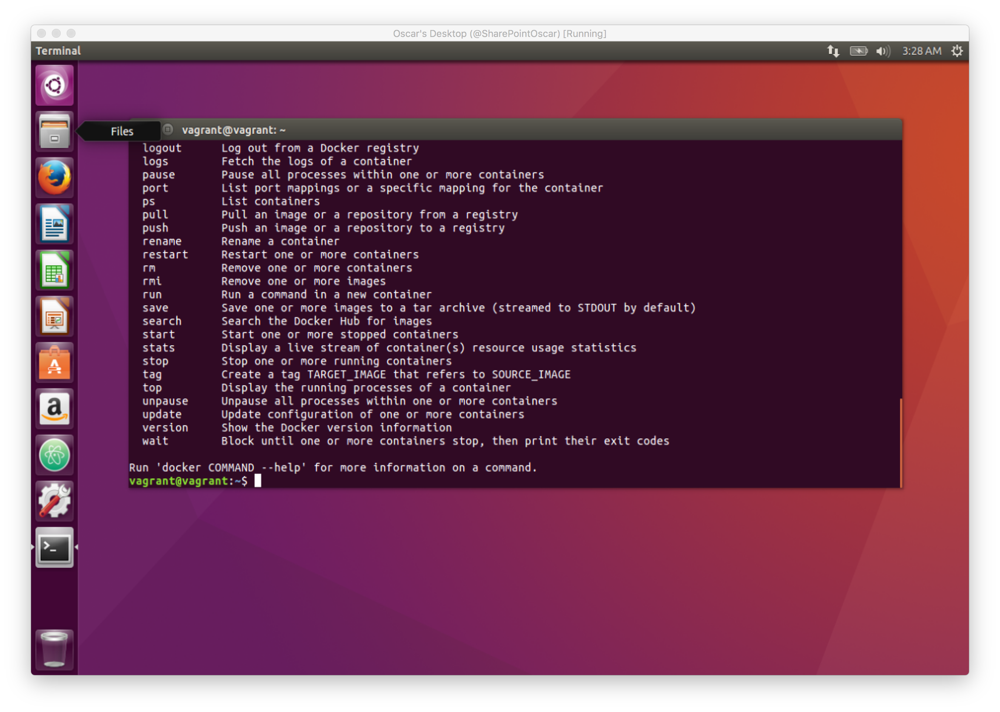

# A Vagrant Base Ubuntu Desktop Box
I like having a quick way to spin up an Ubuntu Desktop, but with some preinstalled stuff. I created this Vagrantfile for that purpose.  It provisions the VirtualBox machine with the following software:

*  Git
*  yum
*  @atom
* Docker
* Docker Compose

## Installation
Assuming you have VirtualBox installed, simply execute the following:

```bash
git clone https://github.com/SharePointOscar/UbuntuDesktop

cd UbuntuDesktop
vagrant up

```


